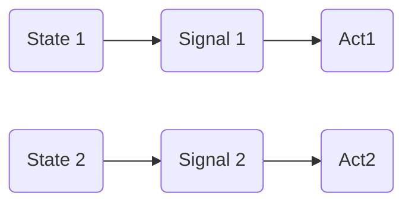

# Correlation of arbitratiness and normativity in conventions

## Introduction
If conventions are mutually expected and mutually beneficial behavioral regularities, how are they different from both social norms and social institutions? O'Connor (2019) draws two crucial distinctions, namely between conventions and social norms, and between functional and arbitrary conventions. The former distinction implies that not all behavioral regularities possess normative force, meaning that conventions and norms are not the same. For instance, friends may have a convention of meeting every Friday evening at a bar, and failing to show up does not necessarily imply a violation of a norm. However, when two cars are driving in the same direction towards each other on the same side of the road, the drivers are compelled to swerve to avoid collision. Failing to do so may result in fines or even accidents; hence, swerving becomes an obligatory normative action.

Furthermore, as Bicchieri (2005) asserts, conventions differ from social norms in their association with self-interest and common interest. While they converge with self-interest, they do not necessarily coincide with common interest. In the case of friends gathering at a bar, there is minimal or no tension between self-interest and common interest; however, when driving cars on the road, there is an inherent tension between these interests. O'Connor notes that conventions and norms exist along a continuum, where conventions can acquire normative force based on their position on this spectrum.

The second distinction pertains to the arbitrary and historically contingent nature of conventions, with the recognition that they are subject to variation and could have been otherwise. This arbitrariness is a fundamental characteristic of conventions, as posited by Lewis. However, @gilbert1992 has critiqued Lewis's work, noting that not all potential resolutions to a coordination problem offer equal benefits for participants. Hence, where one mode of coordination is more desirable than another, conventionality is not entirely arbitrary. To put it differently, arbitrariness in the context of conventions illustrates a continuum ranging from necessity to contingency. For example, signaling among vervet monkeys may be construed as a convention in the Lewisian sense of recurrent behavioral patterns resolving coordination problems [cf. @harms2004; @skyrms2010]. Nevertheless, this conventionality is not historically contingent insofar as multiple solutions are equally remunerative since adaptive dynamics breaks the symmetry between equilibria. Agents may be genetically predisposed towards certain strategies. Some conventions are more functional and others are more arbitrary.

Putting this into a perspective:

- 'animal conventions' are more functional conventions where "normativity", if exists, is grounded in genetically inherited behavioral predispositions;
- social institutions are more arbitrary conventions where normativity is grounded in advanced cognitive capacities like mindreading.

## Emergence of animal conventions
^7ac974

"Animal conventions" are behavioral regularities, where animals "know" how to behave. But how do they "know" that and how these were regularities established in the first place? @baraghith2019 compares game-theoretic and teleosemantic views on emergence of conventions as public meaning. His main claim is that theories of Skyrms [-@skyrms2010] and Millikan [-@millikan1987] share many aspects and can be synthesized to yield empirically testable and philosophically elaborated approach.

The author observes that signals, or public representations, become conventional by stabilization of a strategy profile in a Lewis signaling game, resulting in the emergence of behavioral regularities among involved agents. In other words, convention is generated by stabilization of a signaling system. According to Lewis, a signaling system is a *strict Nash equilibrium*[^1] of a signaling game.

\begin{tikzpicture}[shorten >=1pt,node distance = 3cm, auto]
		\node[state] (S1) {$S_1$};
		\node[state] (S2) [right of = S1] {$S_2$};
		\node[signal] (T1) [below of= S1] {$T_1$};
		\node[signal] (T2) [below of= S2] {$T_2$};
		\node[action] (A1) [above of= T1] {$A_1$};
		\node[action] (A2) [above of= T2] {$A_2$};

    \path[->, >=stealth']
        (S1) edge node {} (T1) 
        (S2) edge node {} (T2) 

        (T1) edge node {}(A1) 
        (T2) edge node {}(A2);

     % labeling the edges and adding a legend    

     % arrows for the labels  
     \draw [-latex'] (-3.8,-0.5)--(-3.3,-0.5); 

     % labels for the edges 
     \draw (-3.7,-0.45)--(-3.7,-0.55); 

     %the label itself 
     \draw (-4,-0.5 ) node[]{Nash Equilibrium ($A_i, T_{3-i}$) } ;  

      % add the legend: boxes and labels 

      %box 1 
      \draw (-4,-0.8 ) rectangle (-3.5, -0.9);  

      % box 2 
      \draw (-4,-1 ) rectangle (-3.5, - 1.15 );  

      % label 1 
      \draw (-3.75 , - 0.85 ) node[]{\tiny{ $i = 1 $}};  

       % label 2 
       \draw (- 3.75 , - 1 .05 ) node[]{\tiny{ $i = 2 $}};  
\end{tikzpicture}

One of the similarities between teleosemantic and signaling approaches is that evolution drives the emergence of successful coordination between agents, be it parts of an organism or different organisms. However, teleosemantic approach operates with the notion of a *function* [@millikan1987], whereas sender-receiver approach emphasizes *adaptive dynamics* by reinforcement learning [@skyrms2010].

In both approaches, conventions depend on their history and involve contingency. As Millikan [-@millikan2005, 29] puts it:

> “A convention is merely a pattern of behavior that is (1 ) handed down from one person, pair, or group of persons to others – the pattern is reproduced – and (2 ) is such that, if *the pattern has a function*, then it is not the only pattern that might have served that function about as well. Thus, if a different precedent had been set instead, a different pattern of behavior would probably have been handed down instead.”

As Baraghith notes, most criticism of teleosemantic view of the emergence of conventions has been that content—or representation of a world state by a sender—lacks explanation solely by its adaptive function or history. However, as Neander and Shea show, teleosemantics might solve the problem of mental content, intentionality, and thus, representation [@neander2008; @shea2018]. In its turn, sender-receiver approach has received criticism for being atomistic and not able to accommodate “mental life”—cases with agents having advanced cognitive capacities like midredaing [@sterelny2017].

Baraghith stresses the crucial difference between speaker meaning and public meaning. In other words, a convention as a signaling system involves two kinds of information: a representation of an observed world state by a sender, and a signal sent from sender to receiver. The former is internal, and the latter is external and hence are not the same. Representation and signal are mental and behavioral parts of a representational system, respectively.

If a signaling system is a strategy profile of a signaling game, what is the latter? A signaling game represents a coordination problem between world states, signals and acts, which are associated probabilistically. One of the simplest cases has two states $W=\{\sigma_{1,}\sigma_2\}$, two messages $M=\{m_{1,}m_2\}$ that a sender $S$ can transfer to a receiver $R$, and two acts $A=\{\alpha_1,\alpha_2\}$, by which $R$ can respond to a received signal. There are pure sender and receiver strategies. The former is a function $s: W\mapsto M$ from world states to signals, and the latter is a function $r: M \mapsto A$ from signals to acts. With two signals and two acts, both sender and receiver have 4 strategies each. Assuming that all strategies are equiprobable, 16 strategies are possible, from which only two are beneficial for both agents and constitute a strict Nash equilibrium.

%%using standard latex packages, draw an extensive form signaling game with two world states, two signals and two acts. mark strict Nash equilibria with arrows.%%

\begin{tikzpicture}[node distance=2cm]
	\node (A) {$A$};
	\node (B) [right of=A] {$B$};

	\node (S1) [above of=A] {Signal 1};  
	\node (S2) [above of=B] {Signal 2};  

	\node (X1) [below left of=A] {$X_1$};  
	\node (Y1) [below right of=X1] {$Y_1$};

	\node (X2) [below left of=B] {$X_2$};  
	\node (Y2) [below right of=X2] {$Y_2$};

    % draw arrows between nodes: from each node to the next in the sequence
    % ... except for the last node which loops back to the first.

    % signal 1 -> A, B -> act 1, act 2 -> world state 1, world state 2
\draw[->] (S1) -- (A);
\draw[->] (B) -- (Y1);
\draw[->] (Y1) -- node[anchor=east,xshift=-0.25cm,yshift=-0.25cm] {\rotatebox{-45}{\tiny $\searrow $}}(X1);

    % signal 2 -> A, B -> act 1, act 2 -> world state 1, world state 2    
\draw[->] (S2) -- node[anchor=south west,xshift=-0.25cm,yshift=-0.25cm] {\rotatebox{45}{\tiny $\nearrow $}}(B);
\draw[->] (A) -- node[anchor=east,xshift=-0.25cm,yshift=-0.25cm] {\rotatebox{-45}{\tiny $\searrow $}}(X2);
\draw[->](Y2)--(X2);
		 % draw loop on last act/world state pair: Y --> X
 %\draw[->](Y)--(X);
		 % draw double arrows on Nash equilibria
\end{tikzpicture}

In an evolutionary perspective of Skyrms [-@skyrms2010], signaling systems are not strict Nash equilibria, but *evolutionary stable strategies* (ESS). It is a strategy which, if adopted by a population, is resilient to invasion by any alternative strategy: $\boldsymbol{s} = (s_1, s_2, ... , s_n)$ such that $\forall \boldsymbol{s'} \neq \boldsymbol{s}$, we have $U(\boldsymbol{s}, \boldsymbol{s}) > U(\boldsymbol{s}, \boldsymbol{s'})$, where $U$ is the average payoff of the population playing the strategies $\boldsymbol{s}$ and $\boldsymbol{s'}$ [@maynardsmith1982]. On this account, given an adaptive process that guides the behavior of agents, any signaling game iterated over time results in an ESS. Depending on the initial conditions, population converges on one of the two signaling systems, what is often modeled with replicator dynamics.[^2]

Another detail of this approach is its connection to information theory. A signal $m_1$ carries information if it changes the probabilities of any world state. The information quantity is measured by how far the probability is moved, and information content—by direction of probability: increasing or decreasing. Franke and Wagner [-@franke2014] show the Bayesian likelihood of a world state $\sigma_i$ given a signal $m_j$: $$P(\sigma_i \mid m_j) = \frac{P(m_j \mid \sigma_i)\times{P(\sigma_i)}}{\sum_t P(m_j \mid \sigma_i)\times{P(\sigma_i)}}$$

It means that if state $\sigma_i$ occurs with prior probabilities $P(\sigma_i)$ and $P(m_{j}\mid \sigma_i)>0$, a signal $m_j$ is sent. Signals may initially contain no intrinsic meaning, and the dynamics does not require any sophisticated cognitive capacities of the agents. They do not need to have pre-existing mental language for a signaling system to be established [@skyrms2010, 7]. This makes sense in “animal conventions”, but not easily so in human ones. Thus, according to Skyrms' sender-receiver approach, convention is an ESS. It makes a lot of sense in “animal conventions”, but its application to human social institutions is not straightforward. As Huttegger puts it [-@huttegger2007, 413]:

> "There is at least one functional aspect of human languages that can fundamentally be expressed in terms of signaling systems: communication facilitates social coordination”.

However, it is not sufficient for evolutionary account of human social coordination resulting in social institutions.

Another important formal approach to the emergence of conventions is due to Harms [-@harms2004]. He synthesizes sender-receiver framework and Millikan's teleosemantics. According to this approach, any semantic convention, or “rule”, might be considered as a “function-stabilizing mechanism”. It helps to coordinate the behavior of different organisms or different parts of an organism to perform an evolutionary adapted biological function. Rules are sets of maps from conditions to processes one by one. They say what to happen given a state of the world. Rules for evolutionary adapted traits (AT) might be expressed as

$$R_{AT}={\{\langle c_{i,}p_{i}\rangle} \mid AT \, sel \, p_{i}\, in \, c_i\}$$

A rule for an adaptive trait is a set of all ordered pairs of a condition and a process such that the trait was selected for performing the process $p_i$ in the conditions $c_i$. [@harms2004, 203]. Since any signaling system consists of states, signals and acts, both signals and acts are adaptive. It means that a convention contains at least two rules:

- a rule of extension — it relates world states and signals by correspondence, has truth-value and is governed by a production mechanism $P$ in a signal sender; $$R(\text{extension})_{P} =  \{ \langle \sigma_{i}, m_{j} \rangle \mid P \, sel \, m_{j} \, in \, \sigma_{i} \}$$

- a rule of intention — it relates signals and acts by causal processes of interpretation and is governed by a response mechanism in a signal receiver; $$R(\text{intension})_{C} =  \{ \langle m_{i}, \alpha_{j} \rangle \mid C \, sel \, \alpha_{j} \, when \, m_{i} \}$$

Harms mentions a third rule, that of a signal production, but it is not relevant for us now:

$$R(\text{production})_{P} =  \{ \langle \text{stimulus}_{i}, m_{j} \rangle \mid P \, sel \, m_{j} \, to \, \text{stimulus}_{i} \}$$

Rules $R(\text{extension}_{P})$ and $R(\text{intension}_{C})$ can be said to comprise a convention as a functional behavioral regularity, for both messages and acts are adapted — the former to world states and the latter to messages. But is it sufficient to define an animal convention?

It has been observed that animal signals not only inform about the world states, but direct the behavior of others, as well. For example, alarm calls of vervet monkeys both convey “Look, there is a leopard!” and “Run up the nearest tree!” [@seyfarth1990; @baraghith2019]. Harms calls this “primitive content” that has both indicative and imperative functions [@harms2004, 189]. Millikan calls it “pushmi-pullyu” representations and notes that purely descriptive and directive representations require a more advanced cognitive processes than primitives [@millikan2005, 166].

*Evolutionary development of primitive content leads to the divergence of its descriptive and directive functions due to advanced cognitive capacities.* As Harms suggests, it introduces a stabilizing, or regulatory, mechanism $SM$ that works “atop” of conventions as rules for adaptive traits and guides behavior in case of failure of any $R_{AT}$. It employs a corrective signal $CS = \{cs_{1}, ...,cs_n\}$ to "enforce" the initial convention when a signal is not sent in the presence of a world state it was selected for:

$$R_{SM}={\{\langle \sigma_{i} \wedge \neg m_{j} \, \text{where} \, \langle \sigma_{i,}m_{j}\rangle} \in R_{AT} \rangle\mid SM \, sel \, cs \, \text{when} \, (\sigma_{i} \wedge \neg m_{j})\}$$

The rule for a stabilizing mechanism is a set of ordered pairs consisting of the failure of an adaptive trait and corresponding corrective signal. If an adaptive trait fails, a stabilizing mechanism detects this failure and sends a corrective signal to restore it.[^3] $sel$ represents a selection operator. This division is echoed in Millikan's work as first-order and higher-order reproductive families [@millikan1987, 23]. Accordingly, conventions $R_{AT}$ are first-order reproductive families and stabilizing mechanisms $R_{SM}$ are second-order, and both serve the same goal of restoring a proper function of $R_{AT}$.

It is tempting to say that on an O'Connor's "convention—social norm" continuum $R_{AT}$ is closer to conventions and $R_{SM}$ is to norms, but in Harms conventions *are* function-stabilizing mechanisms containing normative component by definition. Hence, it means that convention contains both adaptive rules—for extension and intention—and their stabilizing mechanisms: $$\text{convention} = \{R(\text{ex})_{P}, \, R(\text{in})_{C},\, R_{SM\text{(ex)}}, R_{SM\text{(in)}} \}$$$$\text{s.t.} \, (P \, sel \, m_{j} \, \text{in}\, \sigma_{i}) \, \wedge \, (C \, sel \, \alpha_{j} \, \text{when} \, m_{i}) \, \wedge \, (SM \, sel \, cs \, \text{when} \, (\sigma_{i} \wedge \neg m_{j}) \}$$

If a functional convention has normativity by default, as has been established from the analysis of Harms's argument, and if institutions are norm-driven behavioral regularities, how do they differ from "animal conventions"? There are two possible ways to tackle this:

- to ask is there correlation between the "degree of arbitrariness", level of cognitive sophistication and emergence of social norms as arbitrary behavioral expectations, as purely descriptive and directive signals require advanced cognitive capacities;
- to analyze Guala's and Hindriks's idea that the difference is in scope of actionable signals—that humans can invent and follow different rules given the same signal.

## Measuring convention space
Let us start with the first way and study, whether there are correlations between arbitrariness, normativity and cognitive sophistication of agents. These are "functional—arbitrary" and "convention—social norm" axes of O'Connor's "convention space" respectively. However, cognitive sophistication is not in the space, for it is not a characteristic of a conventions. Instead, it will serve as an independent variable.

\begin{tikzpicture}
	\begin{axis}[
		title={},
		xlabel={},
		ylabel={},
		xmin=0, xmax=2,
		ymin=0, ymax=2,
		xtick={1}, xticklabels={Necessary, Arbitrary}, % Sets the tick labels from bottom to top
		ytick={1}, yticklabels={Genetically Inherited, Culturally Inherited}, % Sets the tick labels from left to right
		]
		 \addplot[only marks,mark size=3pt] coordinates {(1,1) (2,2)}; % plot points
		 \addplot[mark=0,fill opacity=0.3] coordinates {(1,1) (2,2)}; % fill the area between points with opacity
		 \addplot[blue] coordinates {(1,0) (1,2)}; % vertical line from bottom to top
		 \addplot[blue] coordinates {(0,1) (2,1)}; % horizontal line from left to right
		 \node at (axis cs: 1.5,-0.25){Animal Conventions}; % name for first point
		 \node at (axis cs: 0.75,-0.25){Human Social Institutions}; % name for second point
	\end{axis}
\end{tikzpicture}

An array of question can be formulated:

1. if a convention is more arbitrary, is it due to normativity as behavioral expectations?
2. do social norms as expectations evolve due to an increased degree of arbitrariness in conventions?
3. what introduces arbitrariness into functional conventions? If, according to Guala and Hindriks, representations of environment are key differentiator for a wider set of actionable signals, are they what introduces arbitrariness?
4. if a convention is more normative (a "social norm" on O'Connor's strectrum), is it due to advanced cognitive capacities?
5. If yes, what is the minimal cognitive architecture for these capacities?
6. although not a game-theoretic question, but how does representation of environment itself evolve?

Answering questions 1-4 requires measurements along both axes: the degree of arbitrariness—is a convention more functional and natural or more contingent and "conventional"—and the degree of normativity—how normative a convention is. Let us introduce such measures, build a model and test two games. As Guala and Hindriks compare "animal conventions" and human social institutions, it can be useful to compare the conventionality in examples they provide:
"Hawk-dove-bourgeois" in animals and humans.

@oconnor2021 proposes an information-theoretic measure for conventionality applicable to both “animal” and human conventions. It helps to break the distinction of functional and arbitrary conventions that she herself pinpoints in @oconnor2019 and calls it a continuum rather than a strict dichotomy. As she is most interested in the emergence of cultural traits like gendered division of labor, she says that most cultural traits are both functional and arbitrary, or contingent, for they “might have been otherwise”.

O'Connor notes that Lewis's notion of convention emphasizes arbitrariness, for a coordination game has at least two *proper coordination equilibria* — a state of a strategic situation where no player can deviate from a selected strategy and improve the payoff for any other player. It means that either of them might have been established equiprobably. @gilbert1992 critiques this notion of arbitrariness and suggests that some equilibria are more favorable than others. In line with this, @simons2019 illustrate the distinction of functional and arbitrary conventions by putting it along three dimensions:

1. Payoff difference — some coordination equilibria have bigger payoffs than others;
2. Likelihood of emergence — some conventions are more likely to emerge than others;
3. Stability — once these conventions have emerged, they are unlikely to be deviated from.

O'Connor proposes to layer these dimensions onto evolutionary models, namely those of replicator dynamics. It allows for specifying what Simons and Zollman mean by the likelihood of emergence (2) and stability of conventions (3).

\begin{figure}[htb]
\centering
\begin{tabular}{c|cc}
 &A&B\\ \hline
A & (1,1) & (0,0) \\ \hline
B & (0,0) & (x,x)
\end{tabular}
\caption{A coordination game where B equilibrium is more favorable given $x > 1$}
\end{figure}

Modelled as replicator dynamics, the game on the figure above has B equilibrium as more “natural” in the sense (1) — that of a higher payoff. The corollary of this is a larger basin of attraction. Given $x = 50$, the phase diagram for this game will look like this:

\begin{tikzpicture}[x = 1cm, y = 1cm]
\draw[->, >=latex] (0,0) -- (5.5, 0);
\draw[->, >=latex] (0,0) -- (0, 5.5);
\node at (5.5,-0.2) {$P_1$};
\node at (-0.2,5.5) {$P_2$};
\fill [fill=black!60] (4,4) rectangle (4.9, 4.9);
\node at (4.45 , 4.45) {98\%};
\fill [fill=white] (1 ,1 ) rectangle (1.9 , 1.9);
\node at (1.45 , 1.45) {2 \%};
 \draw[->, >=latex, very thick] (3,-2) -- (-2,-3);
 \draw[->, >=latex, very thick] (-3,-3)--(-3,-2);
 \end{tikzpicture}

The basin of attraction for A equilibrium takes up 2% of space, while 98% for B. These basins can represent the probability that each outcome evolves, given little information about the initial conditions of the population. Thus, B is more likely to emerge and is more “natural” in the sense (2).

To propose a measure of conventionality, O'Connor focuses on naturalness of conventions as their probability of emergence (2). As has been shown, different equilibria might evolve with different probability, and the sizes of basins indicate the amount of information we gain from examining an evolutionary process. The amount of information in this process is measaure of arbitrariness of a convention. It increases with greater uncertainty about what will evolve and decreases with less.

The relevant information-theoretic measure is Shannon entropy. It measures the average amount of information transmitted through a channel: $$H(x) = \sum_{i} P(x_{i})I(x_{i})$$
The amount of information gained from observing something is related to how much we learn or how surprised we are. It is calculated by summing the probabilities of the signals $P(x_i)$ multiplied by their information content $I(x_{i})$, with $I(x_{i})$ equal to $-\log_{2}P(x_{i})$ — the less probable a signal, the more information it carries. Overall, this weights the probability of each signal being sent by the amount of information it carries, giving a measure of average information in the channel.[^1]

If other conditions hold, a channel has higher entropy when signals are more equiprobable or there are more signals. This is as opposed to a biased channel, with one signal sent 99% of the time, which has an entropy of just $0.08$. Therefore, more equiprobable signals and more signals lead to higher entropy. As probabilities $P(x_{i})$ represent the sizes of the basins of attraction, learning more from an evolutionary process increases the arbitrariness of an evolving phenomenon in question. Given more equilibria or if their basins of attraction are close to equal, the phenomenon is more arbitrary, contingent or “conventional”.

It is possible to measure the naturalness of a convention similar to @simons2019 using $-\log_{2}P(x)$, which represents the information value of a particular outcome. The closer the value of $-\log_{2}P(x)$ to $0$, the more natural a convention. This measure can be used whenever we have clear probabilities for different evolutionary outcomes. However, if there is uncertainty about the initial conditions of a population, it is possible to assign probabilities to different population starting places and not their basins of attraction, for they will not track the probability of emergence correctly. Another case is stochastic dynamics, where each starting point might lead to multiple equilibria depending on chance events. Here, $P(x_{i})$ can be defined as percentage of emergence of different equilibria in an iterated game. For example, if 10 individuals play the game in the figure above with $x=10$ 10K times, it yields 6% chance of emergence of A, and 94% for B.

As O'Connor notes, one problem with a proposed conventionality measure is the source of probabilities. It means that inputs in an entropy equation can be selected quite arbitrarily depending on a case. As there are no actual chances, it can be hard to determine, whether a convention might have been otherwise. To address this worry, she underlines the representatioin-dependence of the measure. It means that we can specify what is probability in terms of a particular model or data set, for instance, basins of attraction, emergence over multiple rounds of simulation, equilibrium time and percentage of societies adopting a behaviour. This eliminates worries about probability and chance in the world. However, representations should be tailored to the intended explanatory goals. However, as representations have limitations, the proposed measure should not be taken as an absolute truth.

Let us now build a model of "Hawk-dove-bourgeois" game and analyze it with O'Connor's measure.

How to measure normativity of a convention? As @crawford1995 and @bicchieri2005 suggest, the degree of normativity can be expressed in the payoff structure of a game.

# Signal-act decoupling
According to Guala and Hindriks, the difference lies in the scope of actionable signals. Animals have a more limited set of actionable signals than humans, as their behavior is tightly coupled to the external stimuli. In game-theoretic terms, for a signaling system is an ESS, it is disadvantageous for the agents to deviate from the signal-act coupling. However, as @sterelny2003 suggests, humans have the ability to decouple stimuli from behavioral responses via the representations of environment. This, according to Guala, allows for invention and following different rules for the same signal. In formal terms, several interpretations are possible:

1. the cardinality of all the sets $\lvert R(\text{ex}_{P}) \rvert$, $\lvert R(\text{in}_{C})\rvert$ and $\lvert R_{SM}\rvert$ is increased, which means that the capacity for richer behavioral response is dependent on the capacity to represent more world states, as Godfrey-Smith and Planer suggest [-@godfrey-smith2014; -@planer-godfrey2021]. It would imply that a convention is rich and complex and has many state-signal-act mappings as well as many stabilizing mechanisms restoring the function of these combinations;



1. the cardinality of only the intention rule $\lvert R(\text{in}_{C}) \rvert$ is increased, meaning that the same set of world states can cause to produce different signals and acts. However, it is not clear what ensures the discrimination of states and successful production of different signals. Moreover, this configuration destroys the ordered pair structure of convention rendering it not functional in the sense of a mapping relationship:

```mermaid
  graph LR;
  
  w1(State 1)--?-->s1(Signal 1)-->a1(Act1)
  w1(State 1)--?-->s2(Signal 2)-->a3(Act2)
  w1(State 1)--?-->s3(Signal 3)-->a4(Act3)


  ```

1. only the number of possible acts increases, hence the ordered pair structure of convention is displaced. This configuration is not functional, as well:

```mermaid
  graph LR;
 
	  w1(State 1)-->s1(Signal 1)
	  s1--?-->a1(Act1)
	  s1--?-->a2(Act 2)
	  s1--?-->a3(Act 3)
	  %%r1<-.Representation.->w1%%
	  %%r1-->a2(Act2)%%
 
  ```

How to decouple stimuli as signals from behavioral responses as acts and preserve the structure of convention as a set of functional rules for extension, intention and stabilization? It leaves us with a tradeoff:

- either convention is indeed functional, but there is no "proper decoupling", for there are just more ordered pairs of state-signal and signal-act;
- or human convention is not strictly functional as "animal conventions" are, and "proper decoupling" occurs by breaking the one-to-one mapping from signals to acts.

**[[@skyrms2010]] ON CATEGORIES: SYNONYMS, BOTTLENECKS, NEW SIGNALS**

Thus , the "naturalness" of conventions comes in degrees. Can a more contingent, or arbitrary, convention still be functional, and does is mean that "functional—contingent" is a false dichotomy? So far, there has been at least two different notions of a "function" at play: biological and mathematical. Harms's view includes both of them:

***

As has been shown, conventions are said to be functional. But if social institutions are 'advanced' conventions with added cognitive capacities to allow normativity, does this functionality stretch to institutions? If yes, it would mean that conventions and institutions evolve by the same mechanism. And if they do evolve by the same mechanism, the question is what ensures the emergence of cognitive capacities responsible for normativity?

@hindriks2021 claim that institutions have two main functions: etiological and teleological ones, where the first is causal and explains why they persist, and the second is evaluative and explains its purpose. The authors argue that the etiological function of institutions is to promote cooperation and the teleological function is to secure values by means of social norms, as institutions might be seen as norm-governed social practices.

Hindriks and Guala build their account of functions of institutions on the basis of [Wright's (1973)](app://obsidian.md/@wright1973) analysis of biological functions, which might be summarized in two main conditions. The first is that the function *F* of an entity *A* is the cause of the existence of *A*. The second condition is that *F* is a consequence of the existence of *A*, which means that *F* is non-redundant to the existence of *A*. The same logic, as the authors argue, applies to institutions. Promotion of cooperation to solve coordination problems is presumably the cause of the persistence of institutions. And securing the normativity of institutions is their purpose.

\begin{table}[h]
\centering
\begin{tabular}{|c||c|c|}
\hline
 & Action A & Action B \\
\hline
\hline
Signal 1 & (2,2) & (3,1) \\
\hline
Signal 2 & (1,3) & (4,0) \\
\hline
\end{tabular}
\caption{\small Lewis signaling game with two agents, two states, two signals and two actions. The payoffs are represented by the numbers in the matrix. The first number in each cell is the payoff for Agent 1 and the second number is the payoff for Agent 2.}
\end{table}

## Footnotes
[^1]: Strict Nash equilibrium is a kind of Nash equilibrium where a player would do worse by changing her strategy.
[^2]: Replicator dynamics is a mathematical model used to describe the evolution of biological populations. It is based on the idea that individuals in a population can replicate themselves over multiple generations, and that their success or failure depends on their behavior relative to other members of the population. Mathematically, it is given by $\dot{x_i} = x_i(f_i(x) - \bar{f}(x))$, where $x_i$ is the proportion of individuals in the population exhibiting a particular behavior, $f_i(x)$ is the fitness associated with that behavior, and $\bar{f}(x)$ is the average fitness in the population.
[^3]: There is an interesting similarity between a semantic regulatory mechanism like Harms' and regulatory networks in biology, that govern the dynamical repertoire of a given system like structural and regulatory genes [[@albert2014]].